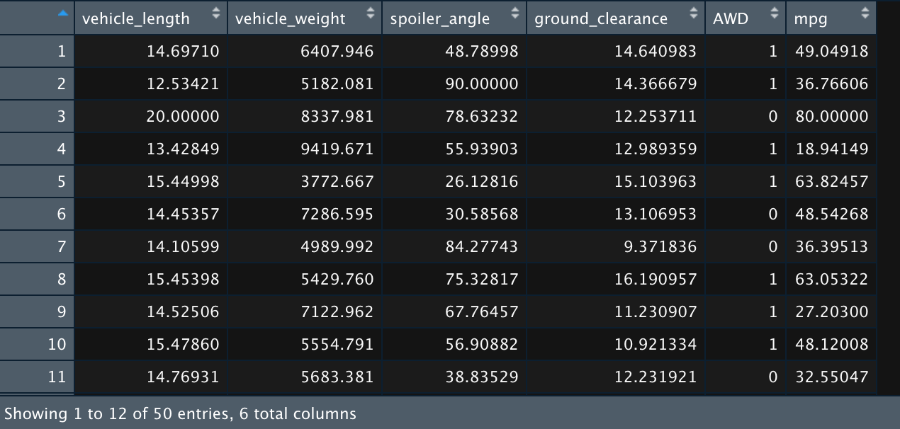

# MechaCar_Statistical_Analysis
statistical analysis using rlang

## Linear Regression to Predict MPG

I ran a multiple linear regression test on the provided data to see how much variance in the mpg of the sampled vehicles is accounted for in a linear combination of ground clearance, spoiler angle, weight, length, and whether it was AWD.

### Input Data

### Output

### Analysis
Assuming a significance level of 0.05, ground clearance and vehicle length were statistically unlikely to provide random amounts of variance to the linear model, thus are significant features in the predictive model. The Intercept also had a p-value of less than 0.0001 which could indicate ground clearance or vehicle length may need scaling or transforming to improve the model, or there may be other variables that can help explain the variability in mpg.

The p-value for the model was far below the significance level of 0.05 as well, thus it is statistically likely that the slope of the linear model should not be considered 0.

The r-squared value of the model is 0.71 which indicates a fairly high probability of using the provided factors to predict mpg on the current data set. However, only having 2 significant factors could be evidence of overfitting and the model may not perform well on future data.

## Summary Statistics on Suspension Coils

Analyzed summary statistics on the PSI from sampled suspension coils from 3 different lots.

### Input Data

### Overall Summary Stats

### Summary Stats by Lot

### Analysis
According to the design specifications for the MechaCar suspension coils, the variance must not exceed 100 pounds per square inch. In total the data does meet that spec point. However, lot 3 shows a variance of 170 PSI which far exceeds the spec and far exceeds the variance of the other lots with variances of less than 10 PSI. This should be concerning and warrants further investigation into why the data from lot 3 was so different from lots 1 and 2.

## T-Tests on Suspension Coils

I ran T-Tests on the suspension coil data to determine if the sample data is statistically different from the assumed population mean of 1,500 PSI.

### All Data:

### Only Lot 1

### Only Lot 2

### Only Lot 3:

### Analysis
Assuming a significance level of 0.05, only lot 3 had a p-value below the significance level. Therefore, regarding the total data there is not enough evidence to reject the null hypothesis that the mean PSI of the data is statistically different from the population mean of 1,500. However, the data from lot 3 alone does show a statistically significant difference in mean.

## Study Design: MechaCar vs Competition
Suppose MechaCar would like to know whether the average sale price of their cars is different than a competitor, AlphaCar.

### Null Hyopothesis
There is no difference in mean sale price between cars made by the two companies.

### Alternate Hypothesis
There is a difference in mean sale price between cars from the two companies.

### Statistical Test
I would utilize a Two Sample T-Test because:
1. I would like to test whether there is a statistical difference between the means of the two samples
2. The independent variable, manufacturer, is dichotomous
3. The dependent variable, sale price, is continuous

### Required Data
For this type of test I would need sale price data for a sample of cars made by MechaCar and a sample of cars made by AlphaCar. The samples should be random and large enough to assume they are roughly normal by the central limit theorem. The samples would also be from two distinct populations since the cars were made by one of the two manufactures. This would satisfy the random, normal, and independent conditions for a two sample t-test.

